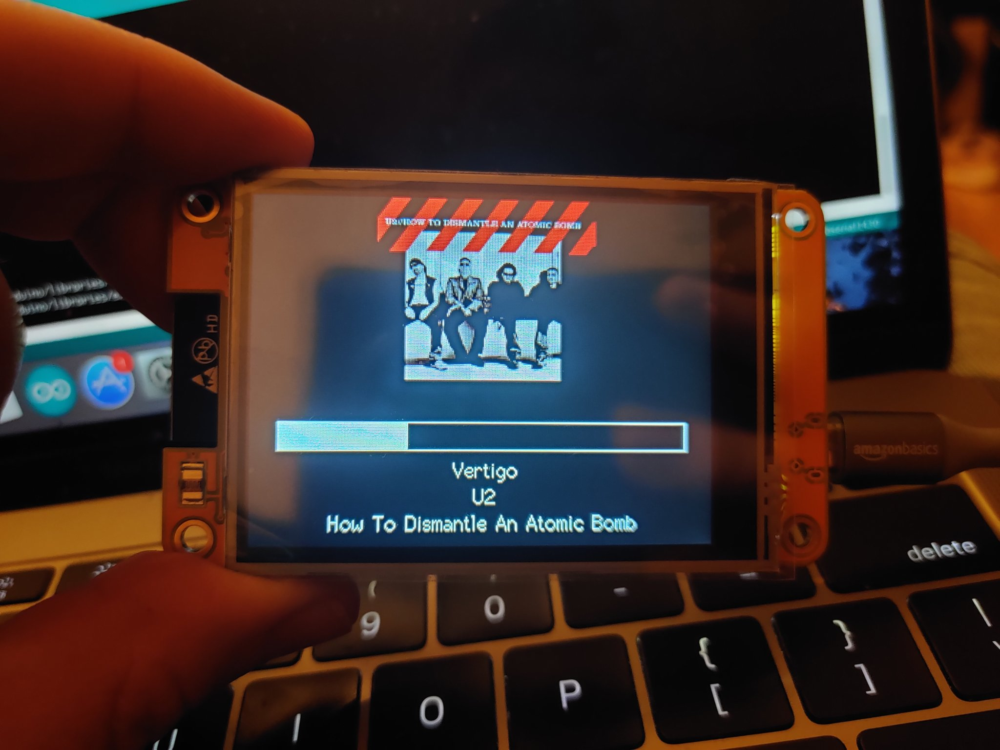
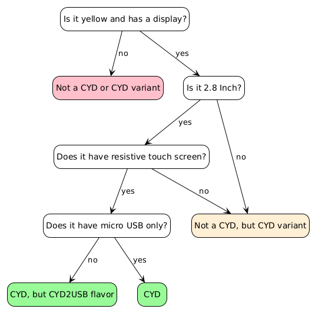

# ESP32-Cheap-Yellow-Display

有一款 ESP32，内置一块 2.8 英寸、分辨率为 320×240 的液晶显示屏，并带有触摸屏，其型号为 “ESP32 - 2432S028R”。由于这个名称念起来不太顺口，我建议将它重新命名为 “廉价黄色显示屏”，简称 CYD。这块显示屏含运费仅约 15 美元，所以我觉得性价比真的很高。

## 功能

CYD 具有以下特点：

- ESP32（支持无线和蓝牙）
- 320×240 液晶显示屏（2.8 英寸）
- 触摸屏（电阻式）
- 用于供电和编程的 USB 接口
- SD 卡插槽、LED 以及一些额外引出的引脚

## 它适合谁？

我认为它对以下几类人有用：

- **刚开始接触硬件工作的人** - 由于所有部件都已连接好，无需焊接或添加额外组件。
- **熟悉硬件操作但比较懒的人** - （比如我）有时候，你只是想做一个项目，而不必组装任何硬件。
- **那些并非真心想学习什么，只是想做出一些很酷的东西的人** - 稍后再详细介绍这个。

## 这个页面的目的是什么？

所以，这硬件相当不错，价格也便宜，但围绕它的软件说明及支持却相当糟糕。仅仅是一个指向某个随机网站上压缩文件的链接

几年前，我发布了[ESP32 Trinity](https://github.com/witnessmenow/ESP32-Trinity)，这是一款用于控制矩阵面板的开源ESP32开发板。我认为，人们从我在Trinity上所做的工作中获得的主要益处并非硬件本身，而是相关文档、示例代码以及现成可用的项目。 

我已不再开发硬件产品，但我觉得如果我们能围绕这款显示屏打造类似的社区，让人们可以分享针对这款显示屏制作的示例和项目，那会很有意思。 

## 我怎么知道一块显示屏是不是CYD的呢？

## 去哪里购买？

Buy from wherever works out cheapest for you:

- [Aliexpress\*](https://s.click.aliexpress.com/e/_DkSpIjB)
- [Aliexpress\*](https://s.click.aliexpress.com/e/_DkcmuCh)
- [Aliexpress](https://www.aliexpress.com/item/1005004502250619.html)
- [Makerfabs](https://www.makerfabs.com/sunton-esp32-2-8-inch-tft-with-touch.html) - 它似乎配备一张16GB的SD卡。Makerfabs也有我的[ESP32 Trinity](https://github.com/witnessmenow/ESP32-Trinity)产品（注意，从Makerfabs向欧盟进口会产生进口费用 ） 

\* = 联盟链接

## CYD使用入门

For details on how to get started with your CYD, please check out the [Setup and Configuration](/SETUP.md) page
有关如何开始使用CYD的详细信息，请查看[设置与配置](/SETUP.md)页面。

## 代码示例

### 基础内容

这是一系列示例集合，展示如何使用CYD的不同功能，是很好的入门之处。[点击此处查看](/Examples/Basics) 

### Alternative Display Libraries

The basics examples are based on the TFT_eSPI display library, but the CYD also works with other display libraries too. Here is some example code if you prefer to use an alternative Arduino library. [Check them out here.](/Examples/AlternativeLibraries)

### ESPHome

Some examples for using the CYD in ESPHome. [Check them out here.](/Examples/ESPHome)

## Additional Info and Links

### Discord

Join the CYD discussion on [my Discord channel](https://discord.gg/nnezpvq)

### 3DPrinting

Some examples of 3D printed stands and cases. [Check them out here.](/3dModels)

### Pin Information

[This page](/PINS.md) contains information about what pins are used where, and what ones are free to use.

### Add-ons

[This page](/ADDONS.md) contains information about additional hardware add-ons that can add functionality to your CYD

### Troubleshooting

[This page](/TROUBLESHOOTING.md) contains information about how to troubleshoot your CYD device

### Hardware Mods

[This page](/Mods/README.md) contains information about some hardware mods that can be performed on the CYD to improve or change some of its functionality

### Media and Video Mentions

[This page](/MEDIA.md) lists any times the CYD project was mentioned somewhere!

## License Info

This project is licensed as MIT as per the [license file](/LICENSE)

The one exception to this is the [OriginalDocumentation](/OriginalDocumentation/) folder, that I do not have the right to license

## Other Languages

Some members of the community have ported some of this information to other languages! 

Please note: I can't gaurantee the accuracy of the translation, how up to date they are or the content on them in general.

- [French / Française](https://github.com/usini/ESP32-Cheap-Yellow-Display-Documentation-FR)
- [German / Deutsch](https://github.com/paelzer/ESP32-Cheap-Yellow-Display-Documentation-DE)

If you would like to contribure a translation, please name the repo with the language name or code in the repo name and you can link it here.

## Help Support what I do!

[If you enjoy my work, please consider becoming a Github sponsor!](https://github.com/sponsors/witnessmenow/)
